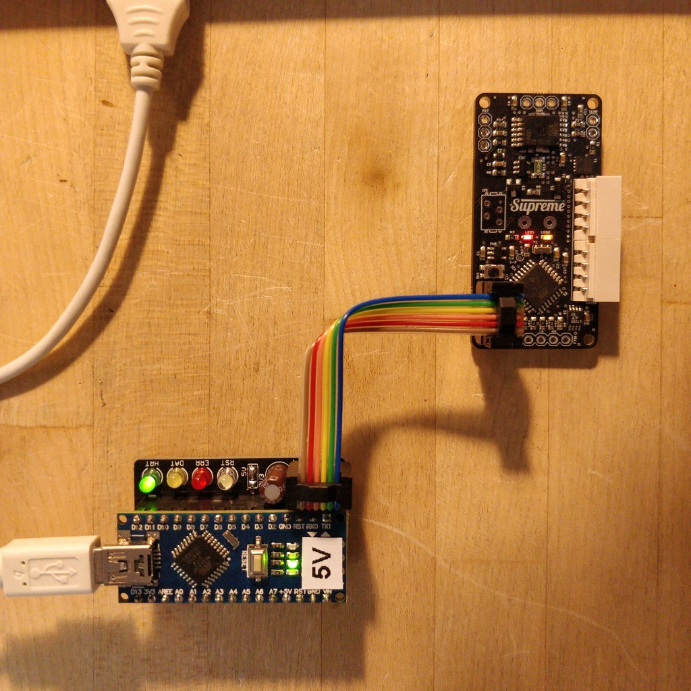
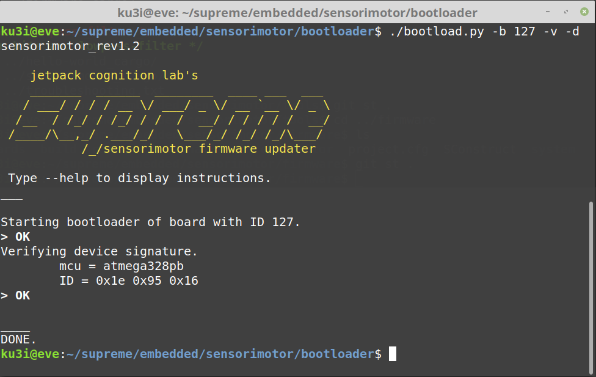

= Sensorimotor Bootloader Manual
Doc Writer <kubisch@informatik.hu-berlin.de>
v0.1, 2021-02-03
:imagesdir: .
:toc:
:toc-placement!:




toc::[]

== Introduction
Welcome to the Sensorimotor bootloader manual. Depending on your Sensorimotor's hardware revision, you might need to configure some files. The defaults will usually be updated to the latest revision. All files of this manuals are licensed under the CREATIVE COMMONS LICENSE CC-BY-NC-SA. This manual is written in the fabulous link:https://asciidoctor.org/docs/what-is-asciidoc/[AsciiDoc] markup language.

== Setting up the Flasher Tool

Get an AVR flasher device. If you have no such device yet, you can either build one yourself using an Arduino as ISP (in-system-programmer) or purchase our recommended one from the jetpack store. If you a are using an AVR flasher other than ArduinoISP, you need to setup this device in the makefile. So you should recall your flasher device description. Example flasher devices are for instance STK500, AVRISP etc.)

Go to the bootloader's source directory:
```
cd bootloader/src
```

and edit the _Makefile_ in order to setup your flasher device. Replace the fields `FLASHER` and `BAUDRATE'), if your device is the ArduinoISP than there is nothing here to do for you.

== Setting up the Microcontroller
Setup the _MCU_ (microcontroller unit) section with regard to your sensorimotor device:

[cols=2*]
|===
| Revision | MCU
| 1.1 | atmega328p
| 1.2 | atmega328pb
|===

== Building the Bootloader
After setting up your flasher device and setting the microcontroller, build the bootloader (for this you need the same tool chain as for building the firmware, so please refer to the _installing the firmware manual_):

```
make
```

== Connecting devices
Connect the flasher with your computer (via USB probably), then connect the flasher and the sensorimotor via the 6-pin cable. If your flasher is able to provide 5 Volts you do not need to separately power the sensorimotor, otherwise connect 6-12V to the bus connector (motorcord). A 3.3 Volt-based flasher might work in some cases but since there is a diode and an LDO in between, it might be too low of a voltage to power the sensorimotor and is not recommended.Note after setting the fuses, the AVRs brown-out detection might kick in occassionally yielding strange reset loops.

== Testing connection
After connecting the devices, check if _avrdude_ is able to detect your
```
make test
```

== Installing the Bootloader
If _avrdude_ successfully detects the correct microcontroller (watch the terminal output) you can install the bootloader and burn the fuses.
```
make install
```

You should now see a yellow LED glow (with a tiny pause after each 4 seconds).
You can now disconnect the flasher from the sensorimotor and instead connect it with your RS485-to-USB/Serial device and power the sensorimotor via bus.

== Uploading the Firmware
Change back to the bootloader's root directory...

```
cd ..
```

...and check via bootscript that the bootloader is able to respond to bus-protocol commands. For the bootscript to be successfull, you need to pass it some command line arguments, such as the board-id and the device type. After having freshly installed the bootloader, the EEPROM is usually erased and so the device ID is 127 (default).
```
./bootload.py -b 127 -v -d sensorimotor_rev1.2
```



If the bootscript was able to ping the bootloader and verify the device ID you can now install the firmware:
```
./bootload.py -b 127 -v -d sensorimotor_rev1.2 -f sensorimotor_xxxxxx.bin
```

This step can now also be used to update the firmware at any time, even if the sensorimotor is already build into your robot or system. However it is recommended to halt the bus communication during updating.

== Setting the ID
After installing/updating the firmware you need to setup your sensorimotors ID (only required if the bootloader was burned, a regular update of the firmware binary does not erase the EEPROM).

Go to the tools directory:
```
cd ../tools
./set_id.py -b 127 -n 0
```

or with _-p [PORT]_ if your RS485-to-USB/Serial device is connected to another port than `dev/ttyUSB0` (default)

With the *-n* argument you can choose your preferred sensorimotor ID, any number between 0 - 126 is valid. Number 127 is default for devices that have no ID set yet. Each board needs a unique ID.

Please note, the initial setup of the sensorimotors (flashing bootloader, setting ID) should be done one after the other, since multiple devices using the same default ID will interfere with each other in their BUS responses.
